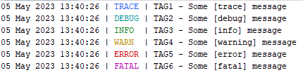

# Logger

[](https://github.com/ximtech/Logger/actions/workflows/cmake-ci.yml)
[](https://codecov.io/gh/ximtech/Logger)

Lightweight logging library written in C.




### Features

- Lightweight design, less than 500-line source code
- Thread-safe
- Console logging with coloring
- File logging rotated by file size
- Log file name with timestamp and duplicate naming resolving
- Easy to subscribe additional custom loggers

### Tradeoffs

- Dynamic memory allocation while file logger init
- No support for logging in interrupt routines

### Add as CPM project dependency

How to add CPM to the project, check the [link](https://github.com/cpm-cmake/CPM.cmake)

```cmake
CPMAddPackage(
        NAME Logger
        GITHUB_REPOSITORY ximtech/Logger
        GIT_TAG origin/main)

target_link_libraries(${PROJECT_NAME} Logger)
```

### Log format
```
dd MMM yyyy hh:mm:ss | LEVEL | TAG - message
```

### Usage

### Single header include

```c
#include "Logger.h"
```

### Available logging macros
```c
LOG_TRACE(TAG, ...);
LOG_DEBUG(TAG, ...);
LOG_INFO(TAG, ...);
LOG_WARN(TAG, ...);
LOG_ERROR(TAG, ...);
LOG_FATAL(TAG, ...);
```

### Console logging
```c
LoggerEvent *consoleLogger = subscribeConsoleLogger(LOG_LEVEL_DEBUG);
assert(consoleLogger->isSubscribed);
LOG_INFO("TAG", "Logging to console");
```

### File logging

***NOTE:*** Log file should have `.log` extension

```c
LoggerEvent *fileLogger = subscribeFileLogger(LOG_LEVEL_DEBUG, "test.log", 1024 * 1024, 3);  // 1Mb file size and 3 backup files
if (!fileLogger->isSubscribed) {
    printf("%s\n", fileLogger->buffer);
    exit(1);
}

LOG_INFO("MAIN", "File logging");
LOG_DEBUG("MAIN", "Format example: %d%c%s", 1, '2', "3");
```

The output of the `test.log` file is the following:
```
05 May 2023 14:14:24 | INFO | MAIN - File logging
05 May 2023 14:14:24 | DEBUG | MAIN - Format example: 123
```

### Backup files

Backup file format:
```
name_yyyy-MM-dd.log
```
For example: 
- For log file with name `cron.log` backup file name will be converted to `cron_2023-05-07.log`
- When multiple backup files for the same timestamp exist, then `id` will be added for each file
  - Example: `cron_2023-05-07.log`, `cron_2023-05-07.log.2`, `cron_2023-05-07.log.3` etc.

### Multiple logger subscriptions

```c
subscribeConsoleLogger(LOG_LEVEL_DEBUG);
subscribeFileLogger(LOG_LEVEL_TRACE, "test.log", 128, 0);  // No backups only single log file
LOG_INFO("MAIN", "Multi logging");
```

### Custom logger subscription

Example implementation for ITM plugin: [link](https://github.com/ximtech/itm_viewer)

```c

#include "Logger.h"

void printItm(uint8_t itmPort, char _char) {
    if (itmPort != 0 && ((ITM->TCR & ITM_TCR_ITMENA_Msk) != 0UL)) {      /* ITM enabled */
        while (ITM->PORT[itmPort].u32 == 0UL) {
            __NOP();
        }
        ITM->PORT[itmPort].u8 = (uint8_t) _char;
    }
}

void logItm(LogLevel severity, const char *message, uint32_t length) {
    uint8_t itmPort;
    switch (severity) {
        case LOG_LEVEL_TRACE:
        case LOG_LEVEL_DEBUG:
            itmPort = 24;
            break;
        case LOG_LEVEL_INFO:
            itmPort = 25;
            break;
        case LOG_LEVEL_WARN:
          itmPort = 26;
          break;
        case LOG_LEVEL_ERROR:
        case LOG_LEVEL_FATAL:
            itmPort = 27;
            break;
        default:
            itmPort = 0;
    }

    for (int i = 0; i < length; i++) {
        printItm(itmPort, message[i]);
    }
}

int main(void) {

    LoggerEvent *itmLogger = subscribeCustomLogger(LOG_LEVEL_DEBUG, logItm);
    assert(itmLogger->isSubscribed);

    LOG_INFO("MAIN", "Hello World!");
    LOG_DEBUG("MAIN", "Some number [%d]", 1234);
}
```
