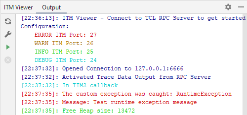

# Logger

[](https://github.com/ximtech/Logger/actions/workflows/cmake-ci.yml)

Simple library for logging written in C. \
Useful with ITM plugin: [link](https://github.com/ximtech/itm_viewer)



### Add as CPM project dependency

How to add CPM to the project, check the [link](https://github.com/cpm-cmake/CPM.cmake)

```cmake
CPMAddPackage(
        NAME Logger
        GITHUB_REPOSITORY ximtech/Logger
        GIT_TAG origin/main
)

target_link_libraries(${PROJECT_NAME} Logger)
```

### Usage

```c

#include "Logger.h"

void printItm(LogLevel level, char _char) {
    if (((ITM->TCR & ITM_TCR_ITMENA_Msk) != 0UL)) {      /* ITM enabled */
        while (ITM->PORT[level].u32 == 0UL) {
        __NOP();
    }
        ITM->PORT[level].u8 = (uint8_t) _char;
    }
}

void println(LogLevel level, const char *msg) {
    if (msg == NULL || level > 31) {
        return;
    }
    for (int i = 0; i<strlen(msg); i++) {
        printItm(level, msg[i]);
    }
    printItm(level, '\n');
}

int main(void) {

    loggerSubscribe(println, LOG_DEBUG_LEVEL);

    LOG_INFO("Hello World!");
    LOG_DEBUG("Some number %s", 1234);
}
```
